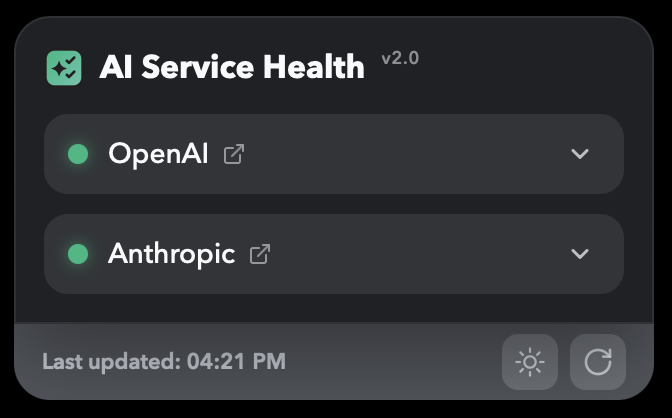
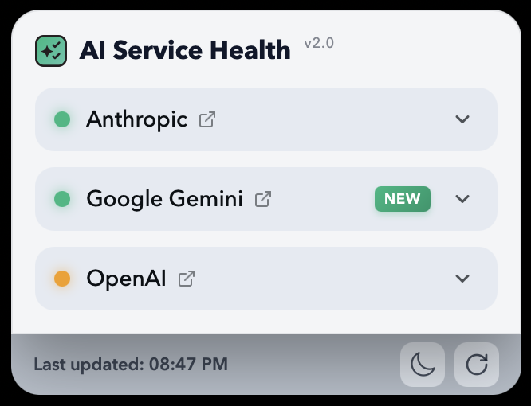
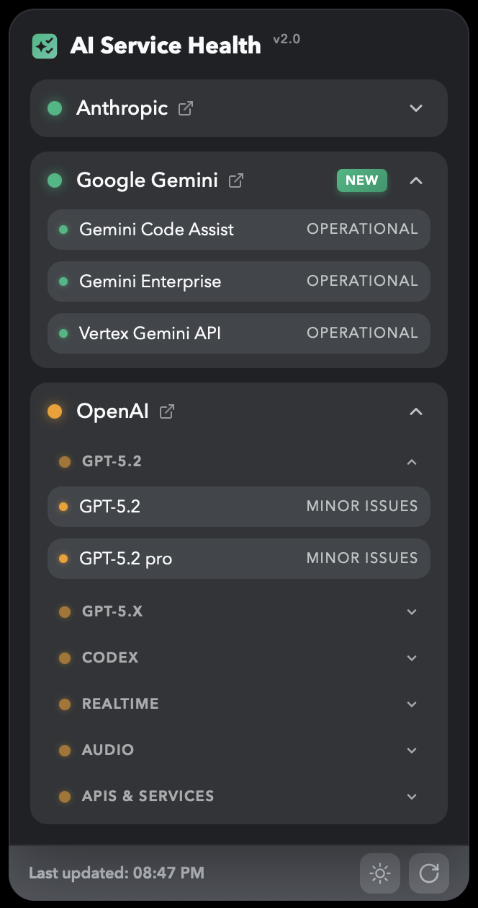
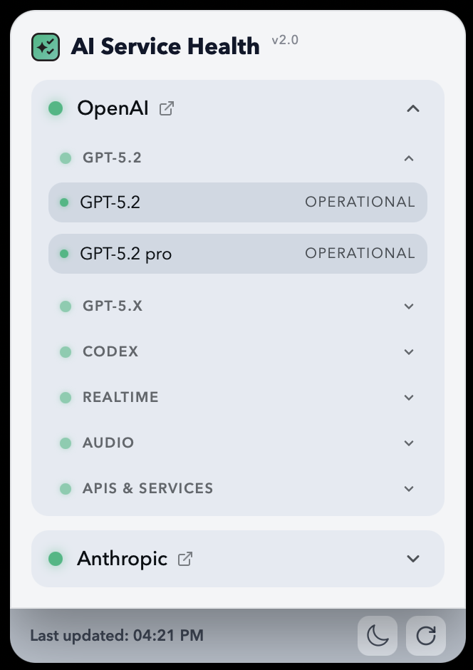

# AI Service Health Widget

<p align="center">
  
</p>

A beautiful, feature-rich desktop widget for macOS [Übersicht](https://tracesof.net/uebersicht/) that monitors real-time service health for **OpenAI** and **Anthropic** AI services.


## ✨ Features

### 🎯 Core Functionality
- **Real-time status monitoring** for OpenAI and Anthropic services
- **Auto-refresh** every 2 minutes with manual refresh option
- **Live API data** from official status pages
- **Color-coded indicators** (🟢 Green: Operational, 🟡 Yellow: Issues, 🔴 Red: Outage)

### 🎨 User Interface
- **Expandable service details** with smooth animations
- **Collapsible model groups** for organized viewing:
  - **OpenAI**: GPT-5.2, GPT-5.x, Codex, Realtime, Audio APIs
  - **Anthropic**: claude.ai, Platform, API, Claude Code
- **Visual hierarchy** with three dot sizes (Service → Group → Model)
- **Rotating chevron icons** for expand/collapse actions
- **Light/Dark theme toggle** with smooth transitions
- **Draggable widget** - move anywhere on screen
- **Custom scrollbar** for long content lists
- **External links** to official status pages

### 🎛️ Controls
- **Drag** the title bar to reposition
- **Click chevrons** (▼/▲) to expand/collapse sections
- **Theme toggle** (☀️/🌙) in footer
- **Manual refresh** button with spinning animation
- **Status page links** (🔗) next to service names

## 📸 Screenshots

<table>
  <tr>
    <td width="50%">
      <h3 align="center">🌙 Dark Mode</h3>
      <p align="center"><strong>Collapsed View</strong></p>
      
    </td>
    <td width="50%">
      <h3 align="center">☀️ Light Mode</h3>
      <p align="center"><strong>Collapsed View</strong></p>
      
    </td>
  </tr>
  <tr>
    <td width="50%">
      <p align="center"><strong>Expanded View</strong></p>
      
    </td>
    <td width="50%">
      <p align="center"><strong>Expanded View</strong></p>
      
    </td>
  </tr>
</table>

## 📋 Requirements

- **macOS** (10.11 or later recommended)
- **Übersicht** ([Download here](https://tracesof.net/uebersicht/))

## 🚀 Installation

### Method 1: Quick Install (Recommended)

1. **Download or clone this repository:**
   ```bash
   git clone https://github.com/d4vid4nderson/ai-status-widget.git
   cd ai-status-widget
   ```

2. **Copy to Übersicht widgets directory:**
   ```bash
   mkdir -p "$HOME/Library/Application Support/Übersicht/widgets"
   cp index.jsx "$HOME/Library/Application Support/Übersicht/widgets/ai-status-widget.jsx"
   ```

3. **Open Übersicht** and the widget will appear automatically

### Method 2: Manual Install

1. Download `index.jsx` from this repository
2. Navigate to: `~/Library/Application Support/Übersicht/widgets/`
3. Create folder: `ai-status-widget/`
4. Place `index.jsx` inside the folder
5. Refresh Übersicht (Cmd+R)

> **Note:** The folder might be named `Übersicht` with combined umlaut on some systems.

## 🎮 Usage

### Basic Controls
- **Move widget**: Click and drag the "AI Service Health" title
- **Expand services**: Click the chevron (▼) next to OpenAI or Anthropic
- **Expand model groups**: Click any model group header (GPT-5.2, GPT-5.x, etc.)
- **Change theme**: Click the sun (☀️) or moon (🌙) icon in footer
- **Refresh data**: Click the refresh icon in footer
- **Open status page**: Click the external link icon (🔗) next to service names

### Visual Indicators

**Status Colors:**
- 🟢 **Green** = All systems operational
- 🟡 **Yellow** = Degraded performance or minor issues
- 🔴 **Red** = Major outage or critical issues
- ⚪ **Gray** = Unknown status

**Dot Sizes (Visual Hierarchy):**
- **Large (10px)** = Main service status (OpenAI/Anthropic)
- **Medium (8px)** = Model group headers (GPT-5.2, APIs, etc.)
- **Small (6px)** = Individual models/components

## 📊 What's Monitored

### OpenAI Services
- **Model Families**: GPT-5.2, GPT-5.x, Codex, Realtime, Audio
- **API Services**: Chat Completions, Embeddings, Files, Batch, Fine-tuning, Moderations, Image Generation, Compliance, Search

### Anthropic Services
- **Products**: claude.ai, platform.claude.com, Claude API, Claude Code

## 🔧 Configuration

The widget uses default settings but you can modify them in `index.jsx`:

```javascript
// Auto-refresh interval (default: 2 minutes)
export const refreshFrequency = 120000;

// Default position (top-left with margin)
const [position, setPosition] = React.useState({ top: 25, left: 25 });

// Default theme
const [theme, setTheme] = React.useState("dark");
```

## 🔄 Updating Models (models.json)

The widget uses a **dynamic model loading system** that fetches model lists from GitHub. This means you can add new models without touching the widget code!

### How It Works

1. **On first load**: Widget fetches `models.json` from this repository
2. **Cached**: Model lists stored in state for the session
3. **Fallback**: If fetch fails, uses hardcoded defaults
4. **Automatic**: Users get updates when they refresh Übersicht

### Adding New Models

When new models are released (e.g., GPT-6):

1. **Edit `models.json`** in this repository
2. **Add new model group**:
   ```json
   {
     "label": "GPT-6",
     "models": ["GPT-6", "GPT-6 turbo", "GPT-6 mini"]
   }
   ```
3. **Commit and push** to GitHub
4. **Done!** Users automatically get updates

📖 **Full guide**: See [MODELS.md](MODELS.md) for detailed instructions

### What's Automatic vs Manual

✅ **Automatic** (no work needed):
- API component status (Chat Completions, Embeddings, etc.)
- Service health indicators
- Real-time status updates

📝 **Manual** (edit models.json):
- Model family groupings (GPT-5.2, GPT-5.x, etc.)
- Component labels and organization
- New model additions (~2-3 times per year)

> **Note**: Model groups are organizational labels for the UI. The status APIs don't provide comprehensive model lists, so these require occasional manual updates via `models.json`.

## 🌐 Data Sources

### Real-Time Status APIs
- **OpenAI Status**: `https://status.openai.com/api/v2/summary.json`
- **Anthropic Status**: `https://status.claude.com/api/v2/summary.json`

Both use the Statuspage API format for real-time service health data.

### Model Configuration
- **Model Lists**: `https://raw.githubusercontent.com/d4vid4nderson/ai-status-widget/main/models.json`

Fetched once per session, cached for performance, with hardcoded fallback.

## 🐛 Troubleshooting

### Widget not appearing
1. Verify Übersicht is running (check menu bar)
2. Confirm widget is in correct directory: `~/Library/Application Support/Übersicht/widgets/`
3. Refresh Übersicht: Click menu icon → "Refresh All Widgets" (or Cmd+R)
4. Check widget is enabled in Übersicht's widget list

### Widget appears then disappears
- Make sure you have the latest version from this repo
- Check Übersicht's debug console for errors (Cmd+Shift+I)
- Restart Übersicht application

### Data not updating
- Check your internet connection
- Verify API endpoints are accessible
- Try manual refresh button
- Wait for next auto-refresh (2 minutes)

### Position resets on refresh
- This is expected behavior (position doesn't persist across refreshes)
- Simply drag the widget back to your preferred location
- Future updates may add position persistence

## 🤝 Contributing

Contributions are welcome! Feel free to:
- **Report bugs or issues** - Use GitHub Issues
- **Add new models** - Edit `models.json` (see [MODELS.md](MODELS.md))
- **Suggest features** - Open a discussion
- **Submit pull requests** - Code improvements welcome
- **Improve documentation** - Help others understand the widget

### Quick Contributions

**Add a new model** (easiest way to contribute):
1. Fork the repository
2. Edit `models.json`
3. Add your model to the appropriate section
4. Submit a pull request
5. Help everyone stay up-to-date! 🎉

## 📝 License

This project is open source and available under the MIT License.

## 🙏 Acknowledgments

- Built with [Übersicht](https://tracesof.net/uebersicht/)
- Status data from [OpenAI Status](https://status.openai.com/) and [Anthropic Status](https://status.claude.com/)
- Developed with assistance from Claude Sonnet 4.5

## 📧 Support

For issues, questions, or suggestions:
- Open an issue on [GitHub](https://github.com/d4vid4nderson/ai-status-widget/issues)
- Check existing issues for solutions

---

**Version 2.0** | Last updated: February 2026
